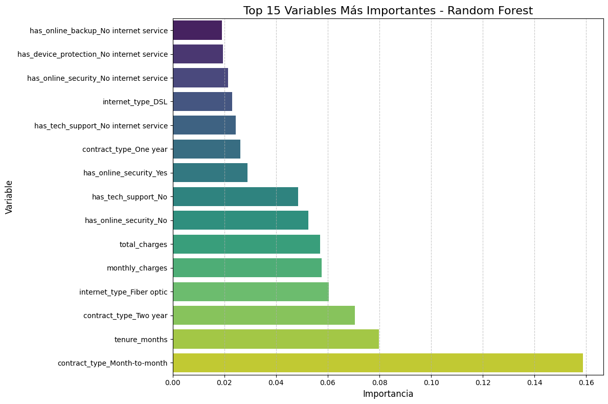
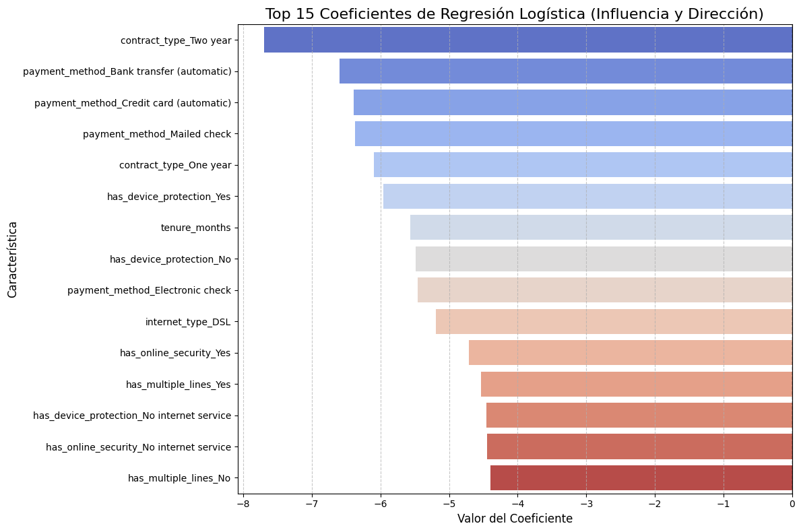
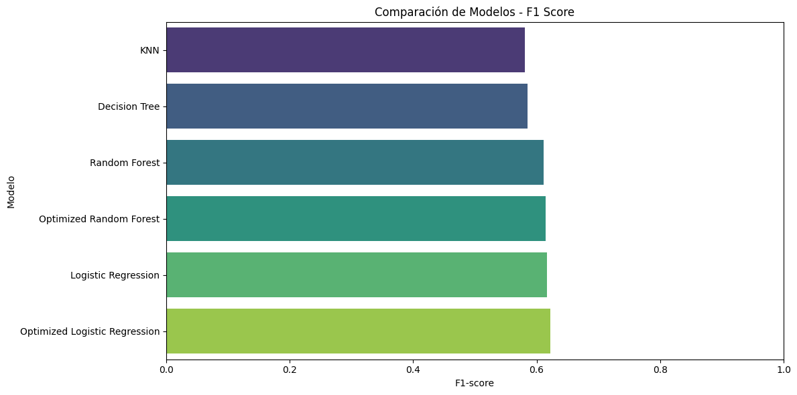

# 📡 Challenge TelecomX LATAM Parte 2

Este proyecto forma parte del **Challenge de la Formación: Estadísticas y Machine Learning G8 - ONE**, y tiene como objetivo aplicar técnicas de **Machine Learning** para investigar la **evasión de clientes** en TelecomX, una empresa de telecomunicaciones.

[](https://colab.research.google.com/drive/1p5NQkiSJm47ZPxECKqzDyjiwPcaPo4BO?usp=sharing)

## Descripción

El objetivo principal es **predecir la cancelación (churn)** de clientes con base en sus características demográficas, de contrato y uso de servicios. A partir de esto, se busca **identificar los factores clave que explican la baja fidelización de los clientes** y **proporcionar recomendaciones estratégicas** para mejorar la retención.

## Estructura del proyecto

## Estructura del Proyecto

- **Cuaderno Principal**: `challenge-telecomx-latam-parte-2.ipynb` (accesible a través de Google Colab para ejecución interactiva).
- **Datos Procesados**: `data/datos_procesados.csv` (conjunto de datos preprocesado listo para el análisis).
- **Visualizaciones**: Carpeta `images/` que contiene los gráficos generados durante el Análisis Exploratorio de Datos (EDA) y el proceso de modelado.

## Modelos Aplicados

- **Árbol de Decisión**
- **Random Forest**
- **K-Nearest Neighbors (KNN)**
- **Regresión Logística**

Los modelos fueron comparados en términos de: **accuracy**, **precision**, **recall** y **F1-score**.

## Análisis Realizados

### 📊 Análisis Exploratorio

- **Distribución de la variable objetivo (`has_churned`)** y su relación con otras variables.
- **Análisis de variables numéricas y categóricas** mediante boxplots y gráficos de barras.
- **Correlaciones con `has_churned`:**

### 🔎 Selección e Interpretación de Variables

- **Random Forest:**

  - Se evaluó la importancia de cada variable usando `.feature_importances_`.
  - Se identificaron las 15 variables más relevantes para la predicción.
  - **Gráfico**:  
    

- **Regresión Logística:**
  - Se analizaron los coeficientes del modelo optimizado para identificar variables protectoras y de riesgo.
  - **Gráfico**:  
    

### 🤖 Comparación de Modelos

- **Modelos evaluados** con las métricas **accuracy**, **precision**, **recall** y **F1-score**:

| Model                         | Accuracy | Precision | Recall | F1-score |
| ----------------------------- | -------- | --------- | ------ | -------- |
| Optimized Logistic Regression | 0.7288   | 0.4937    | 0.8414 | 0.6223   |
| Logistic Regression           | 0.7189   | 0.4834    | 0.8538 | 0.6173   |
| Optimized Random Forest       | 0.7217   | 0.4860    | 0.8342 | 0.6142   |
| Random Forest                 | 0.7018   | 0.4675    | 0.8841 | 0.6116   |
| Decision Tree                 | 0.6990   | 0.4614    | 0.7986 | 0.5849   |
| KNN                           | 0.6711   | 0.4389    | 0.8574 | 0.5806   |

- **Métrica Principal:** F1-score
- **Mejor Modelo:** Optimized Logistic Regression (F1 = 0.6223), balanceando precisión y sensibilidad.
- **Gráfico**:  
  

### 💡 Insights generados

- Contratos mes a mes, cargos elevados y ausencia de servicios como seguridad online son factores de **alto riesgo de churn**.
- Contratos de largo plazo, métodos de pago automáticos y antigüedad protegen contra la cancelación.

### 🪝 Estrategias de retención

- Incentivar contratos largos.
- Implementar programas de fidelización temprana.
- Optimizar servicios y ajustar percepción de precio.
- Promover pagos automáticos y servicios de valor agregado.
- Usar el modelo predictivo como sistema de alerta temprana.

## Uso

**1. Clonar el repositorio:**

```bash
git clone https://github.com/dano796/challenge-telecomx-latam-parte-2.git
```

**2. Abrir el archivo .ipynb en Google Colab.**

**3. Cargar el dataset procesado (data/datos_procesados.csv)**

---

### Challenge de la Formación: Estadisticas y Machine Learning G8 - ONE

### Daniel Ortiz Aristizábal
